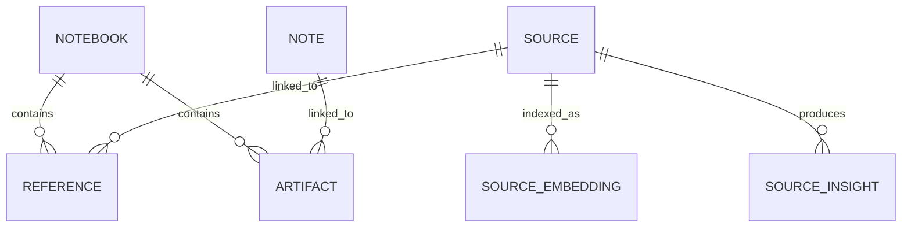
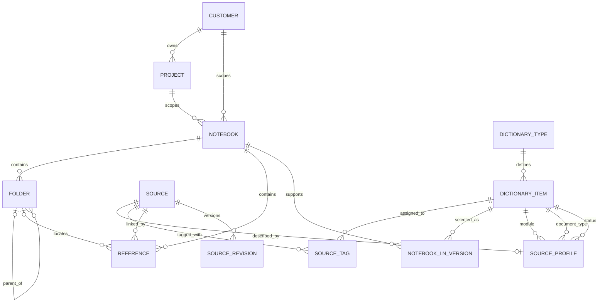
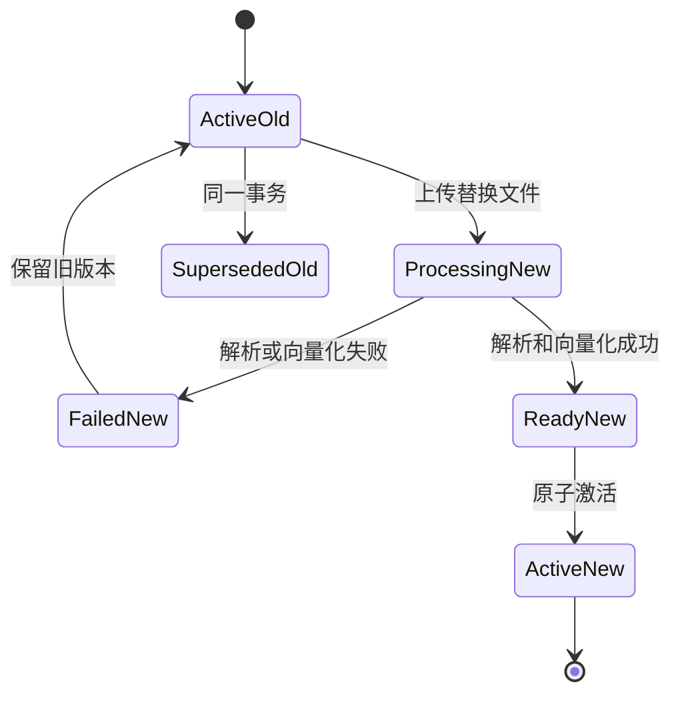

# K-Book 领域模型与数据关系设计

## 1. 文档目的

本文档定义 K-Book 第一期文件组织能力所需的领域对象、对象关系和数据边界。

设计目标：

- 保留 Open Notebook 的 `notebook`、`source`、`reference`、检索和向量化机制。
- 使用增量对象扩展目录、标签、业务元数据和知识库适用范围。
- 避免把所有新增信息直接写入 `source`。
- 支持同一来源关联多个知识库。
- 为文档替换、版本记录和后续权限控制保留稳定结构。

本文档暂不包含完整 API 和页面设计。

## 2. 现有模型

Open Notebook 当前的核心关系为：



关键事实：

- `source` 保存标题、原文件位置、解析全文和扁平 `topics`。
- `reference` 是 `source -> notebook` 的关联。
- 同一个 `source` 可以关联多个 `notebook`。
- 检索结果和向量记录均以稳定的 `source.id` 为来源标识。

K-Book 必须保留这些行为，避免破坏现有检索和问答链路。

## 3. 设计决策

### 3.1 目录属于“文件在知识库中的位置”

目录不能直接作为 `source.folder` 保存。

原因：

- 一个 `source` 可以出现在多个知识库中。
- 同一个文件在知识库 A 中可能位于“需求”，在知识库 B 中可能位于“参考资料”。
- 目录变化不应影响文件内容和向量。

因此目录位置记录在现有 `reference` 关联上：

```text
source (in) -> reference(folder) -> notebook (out)
```

### 3.2 文件固有元数据属于 Source

模块、文档类型、业务版本和状态用于描述文件本身，默认在多个知识库中保持一致。

这些字段通过独立的 `source_profile` 与 `source` 一对一关联，不直接扩张 Open Notebook 的核心 `source` 模型。

### 3.3 标签属于 Source

标签用于描述文件内容，可以跨目录和知识库复用，因此标签关系直接关联 `source`。

### 3.4 客户和项目使用独立对象

客户和项目未来将参与权限控制，不能只保存为字符串或普通标签。

采用独立的 `customer` 和 `project` 对象，并让项目明确属于客户。

### 3.5 LN 版本使用受控字典

LN 版本是标准化选择项，不承担项目成员或权限关系，因此使用统一业务字典管理。

一个知识库可以适用于一个或多个 LN 版本。

## 4. 目标领域关系



## 5. 领域对象

### 5.1 Notebook：知识库

保留现有 `notebook`，增加知识库适用范围字段。

| 字段 | 类型 | 必填 | 说明 |
| --- | --- | --- | --- |
| `name` | string | 是 | 现有知识库名称 |
| `description` | string | 否 | 现有描述 |
| `archived` | bool | 否 | 现有归档状态 |
| `customer` | record&lt;customer&gt; | 否 | 适用客户 |
| `project` | record&lt;project&gt; | 否 | 适用项目 |
| `scope` | string | 否 | 适用范围说明 |
| `created` | datetime | 是 | 现有字段 |
| `updated` | datetime | 是 | 现有字段 |

约束：

- 如果同时选择客户和项目，项目必须属于该客户。
- 未指定客户或项目的知识库可表示通用产品知识。
- LN 版本通过 `notebook_ln_version` 关系维护，避免在 Notebook 中保存自由文本数组。

### 5.2 Customer：客户

| 字段 | 类型 | 必填 | 说明 |
| --- | --- | --- | --- |
| `code` | string | 是 | 稳定业务编码 |
| `name` | string | 是 | 客户名称 |
| `status` | string | 是 | `active` 或 `inactive` |
| `description` | string | 否 | 说明 |
| `created` | datetime | 是 | 创建时间 |
| `updated` | datetime | 是 | 更新时间 |

约束：

- `code` 全局唯一。
- 已有关联项目或知识库的客户只能停用，不能直接物理删除。

### 5.3 Project：项目

| 字段 | 类型 | 必填 | 说明 |
| --- | --- | --- | --- |
| `code` | string | 是 | 稳定项目编码 |
| `name` | string | 是 | 项目名称 |
| `customer` | record&lt;customer&gt; | 是 | 所属客户 |
| `status` | string | 是 | `active`、`closed` 或 `inactive` |
| `description` | string | 否 | 说明 |
| `created` | datetime | 是 | 创建时间 |
| `updated` | datetime | 是 | 更新时间 |

约束：

- `code` 全局唯一。
- 项目不能脱离客户存在。
- 后续项目权限直接关联 `project.id`，而不是解析项目名称。

### 5.4 Folder：逻辑目录

| 字段 | 类型 | 必填 | 说明 |
| --- | --- | --- | --- |
| `notebook` | record&lt;notebook&gt; | 是 | 所属知识库 |
| `parent` | option&lt;record&lt;folder&gt;&gt; | 否 | 上级目录；空表示根目录 |
| `name` | string | 是 | 目录名称 |
| `description` | string | 否 | 说明 |
| `sort_order` | int | 是 | 同级排序 |
| `created` | datetime | 是 | 创建时间 |
| `updated` | datetime | 是 | 更新时间 |

约束：

- `parent` 必须属于同一个知识库。
- 不允许将目录移动到自身或其后代目录下。
- 同一父目录下名称唯一，是否区分大小写由实现统一规定。
- 根目录不是实体记录；`reference.folder = NONE` 表示位于知识库根目录。
- 目录删除默认仅允许空目录。包含内容时必须先移动内容或使用显式级联操作。

### 5.5 Reference：文件与知识库关联

扩展现有 `reference` 关系：

| 字段 | 类型 | 必填 | 说明 |
| --- | --- | --- | --- |
| `in` | record&lt;source&gt; | 是 | 现有来源起点 |
| `out` | record&lt;notebook&gt; | 是 | 现有知识库目标 |
| `folder` | option&lt;record&lt;folder&gt;&gt; | 否 | 文件在该知识库中的目录 |
| `created` | datetime | 是 | 加入知识库时间 |
| `updated` | datetime | 是 | 目录位置更新时间 |

约束：

- `folder` 必须属于 `out` 指向的知识库。
- 同一 `source + notebook` 只允许一个有效 `reference`。
- 移动文件只更新 `reference.folder`，不修改 `source` 或向量。

### 5.6 SourceProfile：文件业务元数据

`source_profile` 与 `source` 一对一。

| 字段 | 类型 | 必填 | 说明 |
| --- | --- | --- | --- |
| `source` | record&lt;source&gt; | 是 | 来源 |
| `module` | option&lt;record&lt;dictionary_item&gt;&gt; | 否 | LN 模块 |
| `document_type` | option&lt;record&lt;dictionary_item&gt;&gt; | 否 | 文档类型 |
| `business_version` | string | 否 | 文档业务版本 |
| `status` | option&lt;record&lt;dictionary_item&gt;&gt; | 否 | 文档状态 |
| `original_filename` | string | 否 | 首次上传文件名 |
| `created` | datetime | 是 | 创建时间 |
| `updated` | datetime | 是 | 更新时间 |

约束：

- 每个 `source` 最多存在一个 `source_profile`。
- `module` 必须引用 `module` 类型的字典项。
- `document_type` 必须引用 `document_type` 类型的字典项。
- `status` 必须引用 `document_status` 类型的字典项。
- 修改 Profile 不触发内容解析或向量重建。

### 5.7 DictionaryType：字典类型

一期预置以下字典类型：

| code | 用途 |
| --- | --- |
| `tag` | 文件标签 |
| `module` | Infor LN 模块 |
| `document_type` | 文档类型 |
| `document_status` | 文档状态 |
| `ln_version` | Infor LN 版本 |

字段：

| 字段 | 类型 | 必填 | 说明 |
| --- | --- | --- | --- |
| `code` | string | 是 | 稳定类型编码 |
| `name` | string | 是 | 显示名称 |
| `description` | string | 否 | 说明 |
| `system` | bool | 是 | 是否系统预置类型 |
| `created` | datetime | 是 | 创建时间 |
| `updated` | datetime | 是 | 更新时间 |

约束：

- `code` 全局唯一。
- 系统预置类型不可删除或修改编码。

### 5.8 DictionaryItem：统一字典项

| 字段 | 类型 | 必填 | 说明 |
| --- | --- | --- | --- |
| `dictionary_type` | record&lt;dictionary_type&gt; | 是 | 所属字典类型 |
| `code` | string | 是 | 稳定编码 |
| `name` | string | 是 | 显示名称 |
| `description` | string | 否 | 说明 |
| `status` | string | 是 | `active` 或 `inactive` |
| `sort_order` | int | 是 | 显示顺序 |
| `color` | string | 否 | 标签等场景的显示颜色 |
| `created` | datetime | 是 | 创建时间 |
| `updated` | datetime | 是 | 更新时间 |

约束：

- 同一字典类型下 `code` 唯一。
- 同一字典类型下有效项名称唯一。
- 停用项保留历史关系，但不能建立新关系。
- 有引用的字典项默认只能停用，不能物理删除。

### 5.9 SourceTag：文件标签关系

关系方向：

```text
source -> source_tag -> dictionary_item(tag)
```

约束：

- 目标字典项必须属于 `tag` 类型。
- 同一文件不能重复关联同一标签。
- 标签变更不触发向量重建。

保留现有 `source.topics` 字段用于上游兼容，但 K-Book 前端不再把它作为统一标签的权威数据源。迁移期可以只读展示旧 Topics，或将其转换为标签字典项。

### 5.10 NotebookLnVersion：知识库适用 LN 版本

关系方向：

```text
notebook -> notebook_ln_version -> dictionary_item(ln_version)
```

约束：

- 目标字典项必须属于 `ln_version` 类型。
- 同一知识库可以关联多个 LN 版本。
- 同一 LN 版本不能重复关联。

### 5.11 SourceRevision：文件版本与替换记录

`source_revision` 表示一次已上传或待激活的文件内容版本。

| 字段 | 类型 | 必填 | 说明 |
| --- | --- | --- | --- |
| `source` | record&lt;source&gt; | 是 | 稳定来源 |
| `revision_no` | int | 是 | 递增版本号 |
| `state` | string | 是 | `processing`、`active`、`failed`、`superseded` |
| `file_path` | string | 否 | 版本文件位置 |
| `original_filename` | string | 否 | 上传时文件名 |
| `content_hash` | string | 否 | 文件内容哈希 |
| `file_size` | int | 否 | 文件大小 |
| `mime_type` | string | 否 | MIME 类型 |
| `error_message` | string | 否 | 处理失败原因 |
| `activated_at` | datetime | 否 | 激活时间 |
| `created` | datetime | 是 | 创建时间 |
| `updated` | datetime | 是 | 更新时间 |

约束：

- 同一 `source` 下 `revision_no` 唯一并单调递增。
- 同一 `source` 同时只能有一个 `active` Revision。
- 新 Revision 成功前，原 Active Revision 和现有检索数据保持不变。
- 失败 Revision 不得替换 Active Revision。
- `source.id` 在替换前后保持不变，保证引用、目录、标签和聊天关系稳定。

第二期只要求保留 Active Revision 和前一个 Superseded Revision；后续可以扩展完整版本历史。

## 6. 文件替换的数据流程

文件替换必须采用“先处理、后切换”，不能先删除旧数据。



建议实现策略：

1. 创建 `source_revision(state=processing)`。
2. 在暂存区域解析新文件并生成新分块与向量。
3. 全部处理成功后开启数据库事务。
4. 将旧 Active Revision 标记为 `superseded`。
5. 更新 `source.asset`、`source.full_text`。
6. 用新分块整体替换该 `source` 的 `source_embedding`。
7. 将新 Revision 标记为 `active`。
8. 提交事务后再按保留策略清理旧文件。

若 SurrealDB 事务或现有命令框架无法安全承载暂存向量，替代方案是使用临时 Source 完成处理，再在事务中迁移结果；临时 Source 不得关联 Notebook，也不得出现在检索结果中。

## 7. 删除与生命周期规则

### 删除知识库

- 沿用现有 Notebook 删除逻辑。
- 同时删除该知识库的 Folder。
- 删除 `reference` 时一并移除目录位置。
- 不自动删除仍被其他知识库引用的 Source。

### 删除文件

- 删除 Source 时删除 SourceProfile、SourceTag、SourceRevision、Embedding 和 Insight。
- 如果只是从某个知识库移除文件，仅删除对应 Reference。

### 删除目录

- 默认只允许删除空目录。
- 文件和子目录必须先移动。
- 后续可增加“移动到上级后删除”，但不得隐式删除 Source。

### 删除字典项

- 无引用时允许删除非系统字典项。
- 有引用时只允许停用。
- 停用后历史文件仍显示该值，并标注已停用。

## 8. 检索边界

第一期文件属性筛选在检索前执行：

- 知识库。
- 目录及其子目录。
- 标签。
- 模块。
- 文档类型。
- 文档状态。
- LN 版本、客户和项目通过知识库范围约束。

元数据筛选只缩小候选 Source 集合，不改变向量内容。

现有全文和向量搜索函数需要增加可选 Source ID 范围，或在查询中关联 Profile、Tag 和 Reference 后进行过滤。不能先检索全部内容再在应用层丢弃结果，否则相关结果数量和排名会失真。

## 9. 后续权限扩展点

本期不实现权限，但以下对象必须保持稳定 ID：

- Customer。
- Project。
- Notebook。
- Folder。
- Source。
- DictionaryItem。

后续授权关系建议独立建模，不在业务对象中保存用户 ID 数组：

```text
principal(user/role) -> permission -> resource(project/notebook/folder/source)
```

目录权限是否继承、显式拒绝是否优先等规则在权限阶段单独设计。

## 10. 第一期建议数据库变更

第一期新增：

- `customer`
- `project`
- `folder`
- `source_profile`
- `dictionary_type`
- `dictionary_item`
- `source_tag`
- `notebook_ln_version`

第一期扩展：

- `notebook.customer`
- `notebook.project`
- `notebook.scope`
- `reference.folder`
- `reference.created`
- `reference.updated`

第二期新增：

- `source_revision`
- 替换处理所需的暂存记录或暂存向量机制

这样可以先完成文件组织和上传流程，不把文件替换的事务复杂度混入第一期迁移。

## 11. 待下一步确认

下一步数据库迁移设计需要确认：

1. 第一批模块字典值。
2. 第一批文档类型字典值。
3. 第一批文档状态字典值。
4. LN 版本是否允许一个知识库选择多个版本。
5. 文件业务版本采用自由文本还是受控格式。
6. 旧 `source.topics` 是否自动迁移为统一标签。
